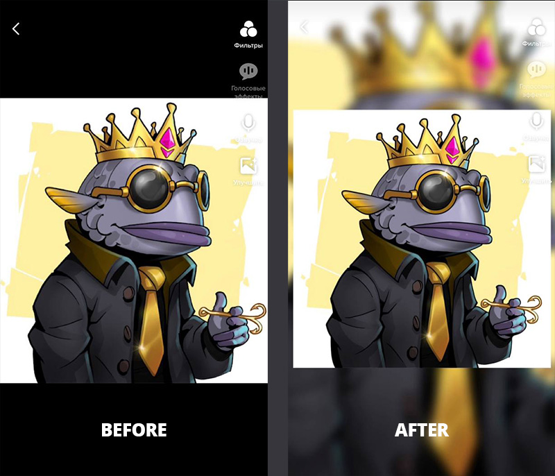

# TikTok Pretty Image

Simple app for create pretty images with blurry background for TikTok and Instagram.

## Screenshot


## How to use

The installation of this dependency is very simple: In fact, it can be installed by just running:

```
npm install
```

Add all source images that need to be converted to a folder:

```
/images/
```

Run node js script:

```
npm run start
```

Look the result in the folder:

```
/dist/
```

## Tips
- for good quality use source images with 1000x1000px resolution

## Credits
Made with love  ❤️ for [Dope Fish NFT](https://dopefishnft.com/links)
